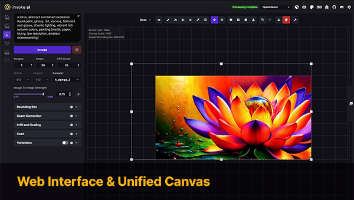

# InvokeAI CI/CD pipeline

Deploy InvokeAI with CI/CD on Elestio

 
 

# Once deployed ...

You can open InvokeAI here:

    URL: https://[CI_CD_DOMAIN]
    login: root
    password: [ADMIN_PASSWORD]

# Pulling a model

To seamlessly pull a model on your InvokeAI instance, follow these intuitive steps:

- Navigate to your InvokeAI instance.

- On the left side of the screen, click on the Model `Manager icon`, represented by a `cube`.

- Inside the Model Manager, select the `Import Models` tab.

- In the `Model Location` field, paste either your HuggingFace Repo ID or a checkpoint/diffusers model URL.

- Click on `Add Model`

HuggingFace Repo ID must follow this format: <repos>/<id>. For example:

    runwayml/stable-diffusion-v1-5.
